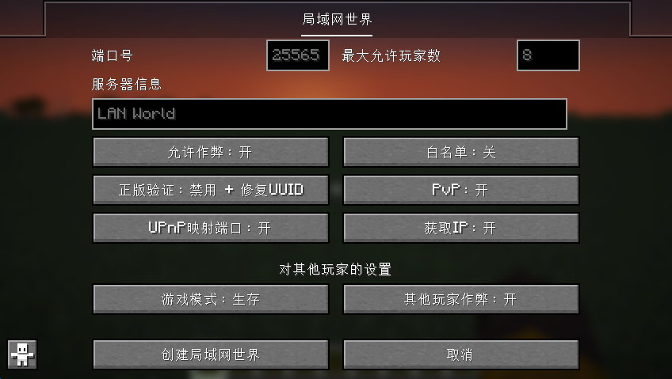

[__English__](README.md)

# LAN World Plug-n-Play

<div align="center">

[![1][1]][2] [![3][3]][4] [![5][5]][6] [![7][7]][8]

</div>

[1]: https://img.shields.io/modrinth/dt/RTWpcTBp?label=Modrinth%0aDownloads&logo=modrinth&style=flat&color=45A35F&labelcolor=2D2D2D
[2]: https://modrinth.com/mod/mcwifipnp

[3]: https://img.shields.io/curseforge/dt/450250?label=CurseForge%0aDownloads&logo=curseforge&style=flat&color=E36639&labelcolor=2D2D2D
[4]: https://www.curseforge.com/minecraft/mc-mods/mcwifipnp

[5]: https://img.shields.io/badge/Available%20for-%201.15%20to%201.21-47376F?logo=files&color=377BCB&labelcolor=2D2D2D
[6]: https://modrinth.com/mod/mcwifipnp/versions

[7]: https://img.shields.io/github/license/Satxm/mcwifipnp?label=License&logo=github&style=flat&color=E51050&labelcolor=2D2D2D
[8]: https://github.com/satxm/mcwifipnp

## 依赖

**Fabric: [Fabric Loader](https://fabricmc.net/use/), [Fabric API](https://modrinth.com/mod/fabric-api)**.

**Quilt: [Quilt Loader](https://quiltmc.org/install/), [QFAPI/QSL](https://modrinth.com/mod/qsl)**.

**Forge: [Forge](https://files.minecraftforge.net/net/minecraftforge/forge/)**.

**NeoForge: [NeoForge](https://projects.neoforged.net/neoforged/neoforge/)**.

## 下载

CurseForge : [https://www.curseforge.com/minecraft/mc-mods/mcwifipnp](https://www.curseforge.com/minecraft/mc-mods/mcwifipnp)

Modrinth : [https://modrinth.com/mod/mcwifipnp](https://modrinth.com/mod/mcwifipnp)

MC百科 : [https://www.mcmod.cn/class/4498.html](https://www.mcmod.cn/class/4498.html)

GitHub : [https://github.com/Satxm/mcwifipnp](https://github.com/Satxm/mcwifipnp)

## 简介

**这个分支仅适用于 Minecraft 版本 [1.21.5, 1.22)!**

使用Minecraft原生界面样式，使用Mojang官方混淆表。

* 修改自[TheGlitch76/mcpnp](https://github.com/TheGlitch76/mcpnp)项目
* UPnP模块来自[adolfintel/WaifUPnP](https://github.com/adolfintel/WaifUPnP)。
*`正版验证`以及`UUID修复`等功能来自[Rikka0w0/LanServerProperties](https://github.com/rikka0w0/LanServerProperties).

## 界面截图

<div align="center">



</div>

## 用法

1. 对于`正版验证`按钮，现在有三个选项：
 - `启用`：启用正版验证，将会比对Mojang服务器数据库验证登录信息，即只允许使用微软帐户登录的玩家加入；
 - `禁用`：即不验证登录信息，允许使用离线模式登录的玩家加入；
 - `禁用 + 修复UUID`：尝试使用离线模式登录的玩家名匹配Mojang服务器用户名称以获取唯一UUID，同时为使用微软帐户登录的用户保留UUID，它也可以防止背包和物品栏内容丢失。
 - 对应的控制台命令为`/onlinemode`与`/uuidfixer enabled`。

2. 新命令 `/uuidfixer` 可以控制在`禁用 + 修复UUID`模式下用户名如何映射为UUID。
 - `/uuidfixer enabled`用于开启与关闭本功能。
 - `/uuidfixer list` 命令可以查看列表中的规则。
 - `/uuidfixer force` 命令可以添加新规则或替换已有规则。
 - `/uuidfixer remove` 命令可以从列表中移除一个已有规则。
 - `/uuidfixer test` 命令可用于检查一个用户名所适用的规则。

3. 允许你修改局域网世界的端口号，并选择是否映射这个端口使用UPnP映射到公网（如果你的路由器支持UPnP）。
使用图形界面或者`/upnp`命令来开启与关闭UPnP支持。

4. 允许你启用或禁用PVP。

5. 允许你自定义MOTD（是玩家客户端的多人游戏服务器列表中显示的服务器信息，显示于名称下方）。

6. 你可以控制其他玩家加入时是否有op权限、是否可以作弊，你也可以使用 `/op` `/deop` 命令进行控制。你可以使用 `/whitelist` 命令构建白名单，然后用其控制其他玩家进是否允许加入你的游戏世界。

7. 你可以使用 `/ban` 来封禁玩家、 使用 `/ban-ip` 来封禁 IP 地址、 `/banlist` 命令可以查看封禁的玩家列表；你可以使用 `/pardon` 来解封玩家、 使用 `/pardon-ip` 来解封 IP地址。

8. 本模组可以自动保存配置文件，并且下次加载世界时会自动载入配置。

9. 本模组可以获取你的IP地址（比如本地 IPv4，公网 IPv4 或 IPv6），而且你可以选择是否复制IP到剪切板，以方便联机使用。`/ip`命令可以检索更多IP信息。

10. 服务器启动后，您可以更改上述大部分设置，但某些选项仅适用于新加入的玩家。

11. 您还可以通过单击左下角的按钮返回原版的“对局域网开放”屏幕。

12. 当本模组安装在服务端上时，只有修复UUID功能可用。只有服务端工作目录下存在`uuid_fixer.json`时修复UUID才会启用。`/uuidfixer`命令在服务端上也可用。除此之外，本模组在服务端上什么也不会做。

## 开发者
### 编译
```
git clone git@github.com:Satxm/mcwifipnp.git
cd mcwifipnp
.\gradlew.bat :fabric:runClient
```
将`fabric`替换为`forge`, `neoforge`, 或者 `quilt`可以构建对应的jar。

### Eclipse
在 Eclipse 中将直接将根文件夹作为gradle项目导入就以开始开发。
如果嫌慢可以在`settings.gradle`中禁用某些目标以加快初始移植/开发速度。
